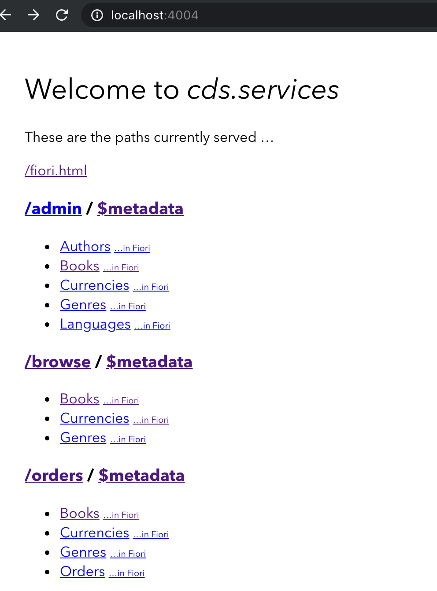

# sap-capire-samples-fiori-annotations

## Preliminaries

- `npm`

## Download, Setup and Run

- `bash cloneAndRun.sh`

If you don't want to get `cds` development kit globally installed (or if you have custom needs) then check [github.com/SAP-samples/cloud-cap-samples](https://github.com/SAP-samples/cloud-cap-samples#download)

## Used Annotations

- com.sap.vocabularies.UI.v1
  - UI.Facets
  - ReferenceFacet
  - FieldGroup
  - FiledGroupType
  - DataField
  - HeaderFacets
  - HeaderInfo
  - HeaderInfoType
  - Identification
  - LineItem
  - SelectionFields
  - Hidden
  - HiddenFilter
  - MultiLineText
- com.sap.vocabularies.Common.v1
  - SemanticKey
  - Label
  - Text
  - ValueList
  - ValueListType
  - ValueListParameterInOut
  - ValueListParameterDisplayOnly
- Org.OData.Capabilities.V
  - InsertRestrictions
  - UpdateRestrictions
  - DeleteRestrictions
- Org.OData.Core.V
  - Computed
  - Immutable 
  - Description

## Learn about Annotations

- [OData Annotations (CDS)](https://cap.cloud.sap/docs/cds/odata-annotations)
- [UI Vocabulary](https://github.com/SAP/odata-vocabularies/blob/master/vocabularies/UI.md)

## Tips and Tricks

### Convert cds to OData V2

Example

```bash
cds samples/bookshop/srv/cat-service.cds -2 edmx
```

### Convert cds to OData V4

Example

```bash
cds samples/bookshop/srv/cat-service.cds -2 edm
```

## How to navigate the UI




